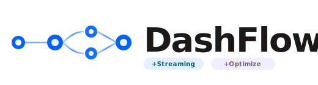
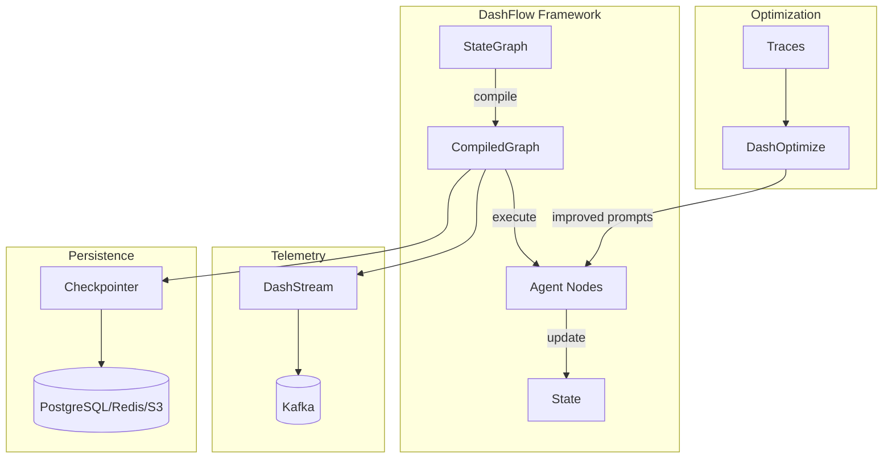

<p align="center">
  
</p>

<h1 align="center">DashFlow</h1>

<p align="center">
  <strong>The Self-Improving AI Operating System</strong>
</p>

<p align="center">
  <em>108 crates. Pure Rust. LangChain-compatible. Faster than anything else.</em>
</p>

<p align="center">
  <a href="https://github.com/dropbox/dTOOL/dashflow/releases"></a>
  <a href="#testing"></a>
  <a href="#performance"></a>
  <a href="#status"></a>
</p>

<p align="center">
  <strong>Copyright 2026 Dropbox</strong><br/>
  <strong>Created by Andrew Yates (ayates@dropbox.com)</strong><br/>
  <strong>Licensed under the Apache License, Version 2.0</strong>
</p>

---

## Why DashFlow?

DashFlow is an **AI Operating System**—a complete platform for building, running, and improving AI agents.

| Layer | What It Does |
|-------|--------------|
| **Runtime** | Graph-based execution engine with state management, checkpointing, parallel execution |
| **Integrations** | 50+ LLM providers, vector stores, and tools out of the box |
| **Optimization** | 17 prompt optimization algorithms (SIMBA, GRPO, MIPROv2, etc.) |
| **Introspection** | 4-level self-awareness: Platform, Application, Runtime, Network |
| **Self-Improvement** | Autonomous analysis, hypothesis testing, improvement plans |
| **Quality** | Validation gates, response checking, retry strategies |

**Why "Operating System"?** Because DashFlow doesn't just run agents—it understands them, monitors them, optimizes them, and improves them autonomously.

### The DashFlow Approach

**Modular Agent Development**
- Define agents as independent nodes (functions)
- Connect via edges (simple, conditional, or parallel)
- Each node can be developed and tested in isolation
- Parallel execution of independent agents

**Built-in Streaming Telemetry**
- DashFlow Streaming: Binary protocol (10-100× more efficient than JSON)
- Real-time visibility into agent execution
- Unified CLI (`dashflow`) with 29 commands (streaming + optimization + introspection + more)
- Not bolted on—streaming is core to the framework

**Integrated Optimization**
- DashOptimize: 17 optimization algorithms (SIMBA, GEPA, MIPROv2, COPRO, COPROv2, GRPO, BootstrapFewShot, etc.)
- CLI commands: `dashflow optimize`, `dashflow eval`, `dashflow train`, `dashflow dataset`
- A/B testing and quality monitoring built in
- Data-driven, not guesswork

---

## Quick Comparison

| Feature | DashFlow | LangChain | DSPy | Homegrown |
|---------|----------|-----------|------|-----------|
| **Language** | Rust | Python | Python | Varies |
| **Self-Improvement** | ✅ Autonomous analysis + hypothesis testing | ❌ No | ❌ No | No |
| **Introspection** | ✅ 4-level (Platform, App, Runtime, Network) | ❌ Limited | ❌ None | DIY |
| **Graph orchestration** | ✅ Type-safe + runtime modifiable | ✅ Dynamic | ❌ No graphs | Maybe |
| **Streaming telemetry** | ✅ Built-in | ❌ External | ❌ No | Maybe |
| **Prompt optimization** | ✅ 17 algorithms built-in | ❌ No | ✅ Only optimization | No |
| **AI self-documentation** | ✅ MCP protocol + live introspection | ❌ No | ❌ No | No |
| **Parallel execution** | ✅ Native | ✅ Native | ❌ No | Maybe |
| **Type safety** | ✅ Compile-time | ❌ Runtime | ❌ Runtime | Varies |
| **Performance** | **584× faster** | Baseline (1×) | ~1× | Varies |
| **Checkpointing** | ✅ Default-enabled (4 backends) | ✅ Basic | ❌ No | Maybe |
| **Zero-config features** | ✅ Batteries included | ❌ Opt-in | ❌ No | Varies |
| **Production observability** | ✅ Complete stack | ❌ DIY | ❌ No | DIY |
| **Testing** | ✅ 16,600+ tests | ✅ Some | ❌ Minimal | Varies |

**Key Insight**: DashFlow is the only AI framework that combines orchestration, optimization, observability, and **autonomous self-improvement** in one integrated system. It's not just a framework—it's an AI OS.

---

## Quick Start

### Installation

```toml
[dependencies]
dashflow = "1.11"
dashflow-streaming = "1.11"  # Optional: streaming telemetry
```

### Basic Example

```rust
use dashflow::{StateGraph, Node};
use serde::{Deserialize, Serialize};

#[derive(Clone, Serialize, Deserialize)]
struct AgentState {
    messages: Vec<String>,
}

async fn agent_node(mut state: AgentState) -> Result<AgentState, Box<dyn std::error::Error>> {
    state.messages.push("Processed by agent".to_string());
    Ok(state)
}

#[tokio::main]
async fn main() -> Result<(), Box<dyn std::error::Error>> {
    let mut graph = StateGraph::new();
    graph.add_node("agent", agent_node);
    graph.set_entry_point("agent");
    graph.set_finish_point("agent");

    let app = graph.compile()?;
    let result = app.invoke(AgentState { messages: vec![] }).await?;

    println!("{:?}", result);
    Ok(())
}
```

See [QUICKSTART.md](QUICKSTART.md) for the complete tutorial.

### Using AI to Generate DashFlow Apps

DashFlow is designed for AI-assisted development. AI agents can use DashFlow's introspection to understand the framework and generate correct code.

**For Claude Code / Cursor:**
```bash
# Point your AI to the project instructions

| Director | Status |
|:--------:|:------:|
| TOOL | ACTIVE |
cat CLAUDE.md  # Contains project context and coding rules

# AI can query DashFlow's capabilities directly
dashflow introspect search "vector store"    # Find relevant modules
dashflow introspect show embeddings          # Get module details
dashflow introspect cli                      # List all CLI commands
```

**For OpenAI Agents:**
```bash
# Use AGENTS.md (follows OpenAI's agents standard)
cat AGENTS.md  # Contains project context for OpenAI agents
```

**AI Workflow:**
1. AI reads `CLAUDE.md` (or `AGENTS.md`) for project context
2. AI uses `dashflow introspect` to discover available modules
3. AI generates code using discovered patterns from `examples/apps/`
4. AI verifies with `cargo check` and `cargo test`

**Example AI prompt:**
```
Using DashFlow, create a RAG agent that:
1. Loads documents from a directory
2. Stores embeddings in Chroma
3. Answers questions using retrieved context

Use dashflow introspect to find the right modules.
```

---

## Core Architecture



### 1. Graph-Based Orchestration

**StateGraph** provides modular, composable agent workflows:

```rust
use dashflow::{GraphBuilder, END};

let mut graph = GraphBuilder::new();
graph
    .add_node("researcher", research_node)    // Independent node
    .add_node("analyst", analyst_node)        // Independent node
    .add_node("writer", writer_node)          // Independent node
    .add_conditional_edges("researcher", router, routes)
    .add_parallel_edges("analyst", vec!["fact_check", "cite_sources"])  // Parallel execution
    .set_entry_point("researcher");

let app = graph.compile()?;
```

**Benefits:**
- Each node is a separate function (easy to develop independently)
- Parallel execution of independent agents (true concurrency)
- Conditional routing based on state
- Cycles for iterative refinement

### 2. DashFlow Streaming (Built-in Visibility)

Stream every agent action to Kafka with minimal overhead:

```rust
use dashflow::DashStreamCallback;

// Enable streaming telemetry
let callback = DashStreamCallback::new(
    "localhost:9092",
    "dashstream-events",
    "my-app",
    "session-123"
).await?;

// Compile graph with callback and execute
let app = graph.compile()?.with_callback(callback);
app.invoke(state).await?;
```

**CLI Inspector:**
```bash
# Watch agents in real-time
dashflow tail --thread session-123

# Profile performance bottlenecks
dashflow profile --thread session-123

# Calculate LLM costs
dashflow costs --thread session-123
```

**Why This Matters:**
- Debug multi-agent interactions in production
- Understand where time/money is spent
- Binary protocol (10-100× more efficient than JSON logging)
- Not an afterthought—core to the framework

### 3. DashOptimize (Built-in Optimization)

Systematically improve prompts using execution data:

```rust
use dashflow::optimize::{RandomSearchOptimizer, OptimizationConfig};

let optimizer = RandomSearchOptimizer::new(
    base_module,
    evaluation_metric,
    OptimizationConfig::default()
);

// Run optimization over collected execution traces
let optimized = optimizer.optimize(training_data).await?;
```

**17 Optimization Algorithms:**
- **MIPROv2** - Multi-stage instruction and demo optimization with Bayesian search
- **BootstrapFewShot** - Generate few-shot examples from successful traces
- **GRPO** - Group Relative Policy Optimization (RL-based reasoning)
- **SIMBA** - Stochastic Introspective Mini-Batch Ascent
- **COPRO/COPROv2** - Collaborative Prompt Optimizer for instruction refinement
- **BootstrapFinetune** - Distill prompt-based program into model weights
- **AutoPrompt** - Gradient-free discrete prompt search
- **GEPA** - Genetic Evolution Prompt Adaptation
- **RandomSearch** - Random search baseline optimization
- **Ensemble** - Combine multiple program variants
- **KNNFewShot** - K-nearest neighbors for example selection
- **LabeledFewShot** - Direct use of labeled examples
- **BetterTogether** - Meta-optimizer combining multiple strategies
- **BootstrapOptuna** - Optuna-backed hyperparameter optimization
- **AvatarOptimizer** - Iterative instruction refinement via feedback
- **InferRules** - Generate human-readable rules from examples

**Why This Matters:**
- Systematic improvement (not trial-and-error)
- Uses real execution data from DashFlow Streaming
- Multiple algorithms for different scenarios
- A/B testing infrastructure included

---

## Key Features

### Batteries Included (Zero-Config)

DashFlow works great out of the box with **no configuration required**. All important features are **enabled by default**:

```rust
let compiled = graph.compile()?;

// All of these work with ZERO configuration:
compiled.manifest()        // Graph introspection
compiled.platform()        // Platform knowledge
compiled.introspect()      // Unified introspection API
compiled.metrics()         // Execution metrics (auto-collected)
compiled.performance()     // Performance monitoring
// Plus: validation, checkpointing, retries, resource limits
```

**Default Capabilities:**
| Feature | Default Behavior | Opt-Out Method |
|---------|------------------|----------------|
| **Graph Validation** | Auto-validates on compile | `compile_without_validation()` |
| **Introspection** | Full manifest/platform access | `.without_introspection()` |
| **Checkpointing** | In-memory checkpointer | `.without_checkpointing()` |
| **Retry Policy** | 3 retries, exponential backoff | `.without_retries()` |
| **Metrics** | Auto-collected | `.without_metrics()` |
| **Resource Limits** | 25 recursion, 5min node, 1h graph | `.without_limits()` |

**Opt-out when needed** (explicit choice):
```rust
let compiled = graph
    .compile()?
    .without_checkpointing()   // Disable checkpointing
    .without_retries()         // Disable retries
    .without_metrics();        // Disable metrics collection
```

**Philosophy:** Zero-config gives full capabilities. Advanced users can opt-out explicitly.

### MCP Self-Documentation Protocol

Every DashFlow application can expose itself as an MCP (Model Context Protocol) server for AI-to-AI understanding:

```rust
use dashflow::mcp_self_doc::{HelpLevel, McpSelfDocServer};

// Generate CLI help at different detail levels
let help_brief = compiled.generate_help(HelpLevel::Brief);          // tl;dr (30 seconds)
let help_more = compiled.generate_help(HelpLevel::More);            // Architecture (2-3 min)
let help_impl = compiled.generate_help(HelpLevel::Implementation);  // Full details (10-15 min)

// Start MCP self-documentation HTTP server
let server = McpSelfDocServer::new(compiled.introspect(), 8080);
server.start().await?;
```

**HTTP Endpoints (App-Level):**
| Endpoint | Description |
|----------|-------------|
| `/mcp/about` | Brief summary of what this app does |
| `/mcp/capabilities` | What tools and features are available |
| `/mcp/architecture` | Graph structure and node connections |
| `/mcp/implementation` | Full implementation details |
| `/mcp/nodes` | List all nodes with summary info |
| `/mcp/nodes/:name` | Detailed info for a specific node |
| `/mcp/edges` | All graph connections |
| `/mcp/dependencies` | Project dependencies |
| `/mcp/features` | DashFlow features in use |
| `/mcp/introspect?q=...` | Natural language queries |

### Self-Aware AI Development

**DashFlow is built by AI workers who use DashFlow's introspection to understand themselves.**

The introspection infrastructure isn't "for humans, also useful for AI." It's **for the AI to understand itself**, and humans can look at the same data.

**Complete Data Parity (AI = Human):**
- AI reads the **same Prometheus metrics** as Grafana dashboards
- AI uses the **same trace visualization** as CLI `visualize`
- AI parses the **same structured logs** as human log viewers
- When Prometheus is down, AI gracefully degrades to traces-only

**Self-Improvement CLI:**
```bash
# List improvement plans (auto-creates storage - no init needed)
dashflow self-improve plans
dashflow self-improve plans --status approved

# Run analysis to generate new plans
dashflow self-improve analyze

# Approve a plan for implementation
dashflow self-improve approve <plan-id> --assignee "worker-N"

# Start background analysis daemon (continuous monitoring)
dashflow self-improve daemon

# Generate regression tests from execution traces
dashflow self-improve generate-tests --limit 10
```

### Four-Level Introspection

DashFlow provides complete self-awareness at **four distinct levels**, all accessible via ONE command:

| Level | Scope | What It Answers | Example |
|-------|-------|-----------------|---------|
| **Platform** | DashFlow framework | What modules/capabilities exist? | "Is distillation implemented?" |
| **Application** | Your project | What graphs/packages do I have? | "What graphs do I have?" |
| **Runtime** | Execution | What's happening? Why did X happen? | "Why did search run 3 times?" |
| **Network** | Package ecosystem | What packages exist? Who published? | "What RAG packages exist?" |

```bash
# ONE command routes to the correct level automatically
dashflow introspect ask "Is distillation implemented?"   # Platform
dashflow introspect ask "What graphs do I have?"         # Application
dashflow introspect ask "Why did search run 3 times?"    # Runtime
dashflow introspect ask "What RAG packages exist?"       # Network
```

**Unified API:**
```rust
// Single entry point for all four levels
let introspection = DashFlowIntrospection::for_cwd()?;
let response = introspection.ask("Why did search run 3 times?");
```

**Programmatic API:**
```rust
// Get all three levels in one call
let unified = compiled.unified_introspection();

// Level 1: Platform - DashFlow framework capabilities (shared by all apps)
let platform = compiled.platform_introspection();
platform.version();               // DashFlow version info
platform.features();              // Available features (checkpointing, retries, etc.)
platform.node_types();            // Supported node types
platform.edge_types();            // Edge types (simple, conditional, parallel)
platform.templates();             // Built-in templates (supervisor, react_agent)

// Level 2: App - This specific compiled graph
let app = compiled.introspect();
app.manifest();                   // Graph structure (nodes, edges, entry point)
app.architecture();               // Pattern analysis
app.capabilities();               // What this app can do

// Level 3: Live - Runtime execution state
let tracker = ExecutionTracker::new();
let compiled = compiled.with_execution_tracker(tracker.clone());
let executions = compiled.live_executions();  // All tracked executions

// Real-time event streaming (SSE)
let stream = tracker.subscribe();
while let Some(event) = stream.recv().await {
    match event {
        ExecutionEvent::NodeEntered { node, .. } => println!("Entered: {}", node),
        ExecutionEvent::NodeExited { node, .. } => println!("Exited: {}", node),
        ExecutionEvent::ExecutionCompleted { .. } => break,
        _ => {}
    }
}
```

**Platform Introspection Endpoints:**
| Endpoint | Description |
|----------|-------------|
| `/mcp/platform/version` | DashFlow version and build info |
| `/mcp/platform/features` | All available features |
| `/mcp/platform/node-types` | Supported node types |
| `/mcp/platform/edge-types` | Supported edge types |
| `/mcp/platform/templates` | Built-in templates |
| `/mcp/platform/states` | Available state implementations |
| `/mcp/platform/query?q=...` | Natural language query |

**Live Execution Endpoints:**
| Endpoint | Description |
|----------|-------------|
| `/mcp/live/executions` | List all tracked executions |
| `/mcp/live/executions/:id` | Get execution details |
| `/mcp/live/executions/:id/node` | Current node |
| `/mcp/live/executions/:id/state` | Current state values |
| `/mcp/live/executions/:id/history` | Execution history |
| `/mcp/live/executions/:id/metrics` | Performance metrics |
| `/mcp/live/executions/:id/checkpoint` | Checkpoint status |
| `/mcp/live/executions/:id/events` | SSE event stream (single execution) |
| `/mcp/live/events` | SSE event stream (all executions) |

**Natural Language Query Types:**

The introspection interface (`introspection_interface.rs`) routes questions to specialized analyzers:

| Query Pattern | Analysis Type | What It Does | Example |
|---------------|---------------|--------------|---------|
| "Why did..." | Causal analysis | Traces cause-effect chains | "Why did search run 3 times?" |
| "What if..." | Counterfactual analysis | Explores alternatives | "What if I had used parallel execution?" |
| "How can I..." | Optimization suggestions | Recommends improvements | "How can I be faster?" |
| "Am I..." | Self-assessment | Evaluates performance | "Am I performing well?" |
| "What is/are..." | State/structure queries | Describes current state | "What is the current node?" |
| "When did..." | Timing queries | Analyzes temporal patterns | "When did the error occur?" |

```bash
# CLI usage (auto-loads latest trace from .dashflow/traces/)
dashflow introspect ask "Why did search run 3 times?"
dashflow introspect ask "What if I had cached the results?"
dashflow introspect ask "How can I reduce latency?"
```

**CLI Integration:**
```rust
// Automatic --help flag handling
use dashflow::mcp_self_doc::process_cli_help;

fn main() {
    if let Some(result) = process_cli_help(&compiled, &std::env::args().collect())? {
        if result.should_exit() {
            return Ok(());
        }
    }
    // Normal app execution...
}
```

**Why This Matters:**
- AI agents can query "what are you?" and get structured responses
- Progressive disclosure: brief -> detailed -> implementation-level
- Standardized format across all DashFlow applications
- Natural language query interface for flexible introspection

### Parallel Execution

Execute independent agents concurrently:

```rust
graph.add_parallel_edges("router", vec!["agent_a", "agent_b", "agent_c"]);
```

All three agents run simultaneously. Results are merged using `MergeableState` trait.

### Checkpointing (4 Backends)

```rust
// PostgreSQL
let checkpointer = PostgresCheckpointer::new("postgresql://localhost/db").await?;

// Redis (5-10× faster than Python)
let checkpointer = RedisCheckpointer::new("redis://localhost").await?;

// S3 (for long-term storage)
let checkpointer = S3Checkpointer::new("bucket", "prefix").await?;

// DynamoDB
let checkpointer = DynamoDBCheckpointer::new("table").await?;
```

**Performance**: 526× faster checkpointing than Python

### Stateful Workflows

```rust
// Resume from checkpoint
let thread_id = ThreadId::new("conversation-123");
let result = app.invoke_with_config(state, config.with_thread_id(thread_id)).await?;

// Later: resume from same thread
let resumed = app.invoke_with_config(new_input, config.with_thread_id(thread_id)).await?;
```

### Human-in-the-Loop

```rust
graph.add_node("human_approval", approval_node);
graph.add_conditional_edges("agent", check_if_approval_needed, routes);
```

---

## Real Applications

### Superhuman Librarian (RAG Paragon)
**Scenario**: Full-featured RAG system over Project Gutenberg books

Features demonstrated:
- **Hybrid Search**: BM25 keyword + kNN semantic via OpenSearch
- **Parallel Execution**: Fan-out multi-strategy search
- **Full Telemetry**: Prometheus, Grafana, Jaeger integration
- **Memory**: Persistent conversation history and bookmarks
- **Evaluation**: Golden Q&A dataset with automated scoring

```bash
# Quick start
cd examples/apps/librarian
docker-compose up -d
cargo run -p librarian --bin indexer -- --preset quick
cargo run -p librarian -- query "Who is Elizabeth Bennet's love interest?"
```

See [examples/apps/librarian/README.md](examples/apps/librarian/README.md) for full documentation.

---

## Performance

### Framework Operations (vs Python)

Measured on Apple M1 Max (November 2025):

| Operation | DashFlow (Rust) | Python | Speedup |
|-----------|-----------------|--------|---------|
| Graph compilation | 1.14 ms | 1,202 ms | **1,054× faster** |
| Sequential execution | 0.22 ms | 203 ms | **923× faster** |
| Conditional branching | 0.18 ms | 167 ms | **927× faster** |
| Parallel execution | 1.43 ms | 234 ms | **163× faster** |
| Checkpointing | 0.76 ms | 400 ms | **526× faster** |
| **Average** | - | - | **584× faster** |

**Memory**: 73× more efficient than Python equivalents

### Real-World Performance

End-to-end RAG applications (where LLM API latency dominates) see **1.5-2× faster** total execution with **73× less memory** compared to Python LangChain.

**Why?** Framework overhead is 584× faster, but LLM API calls take seconds. In production, you still get significant wins from faster checkpointing, lower memory, and better parallelism.

---

## DashFlow Streaming

### Protocol Features

- **Binary encoding**: Protocol Buffers (<100μs encode time)
- **Differential updates**: JSON Patch (99% size reduction)
- **Compression**: Zstd/LZ4 (5:1 compression ratio)
- **Distributed**: Kafka integration for multi-node systems

### CLI Inspector

```bash
# Tail live events (like tail -f for agents)
dashflow tail --thread <id>

# Profile execution time per node
dashflow profile --thread <id>

# Calculate LLM costs
dashflow costs --thread <id>

# Generate flamegraph
dashflow flamegraph --thread <id> --output graph.svg

# Export to JSON for analysis
dashflow export --thread <id> --format json > output.json

# Replay execution (time-travel debugging)
dashflow timeline replay --thread <id>

# Diff state changes
dashflow diff --thread <id> --checkpoint1 <checkpoint_1> --checkpoint2 <checkpoint_2>

# Inspect a specific thread
dashflow inspect --thread <id> --stats
```

**Use Case**: Debug agent interactions in production without modifying code.

---

## DashOptimize

### Optimization Algorithms

DashOptimize provides systematic prompt improvement:

**1. SIMBA** (Simplify by Iterative Merging)
- Combines best performing prompts
- Iteratively refines based on eval data

**2. Random Search**
- Baseline optimization method
- Useful for establishing performance bounds

**3. GEPA** (Generative Probabilistic Agent)
- Generates new prompt variations
- Bayesian optimization approach

**4. BootstrapFewShot**
- Learns from execution traces
- Automatically generates few-shot examples

**5. KNNFewShot**
- Nearest-neighbor example selection
- Adapts examples based on similarity

**6. Ensemble**
- Combines multiple optimizers
- Achieves better results than any single method

### RL Optimization (Phase 2B)

Advanced reinforcement learning optimizers for reasoning tasks:

**7. GRPO** (Group Relative Policy Optimization)
- RL-based optimization for chain-of-thought reasoning
- Policy gradient methods with group normalization
- Best for multi-hop QA, math reasoning, code generation

```rust
use dashflow::optimize::optimizers::GRPO;

let grpo = GRPO::new(GRPOConfig {
    group_size: 4,
    learning_rate: 1e-5,
    kl_penalty: 0.1,
    ..Default::default()
});
let optimized = grpo.optimize(dataset).await?;
```

**8. BootstrapFinetune**
- Generate fine-tuning datasets from execution traces
- DashStream/Kafka integration for trace collection
- Best for distilling agent behavior into smaller models

**9. BetterTogether**
- Meta-optimizer combining multiple strategies
- Automatically selects best approach per task
- Ensemble of optimizers with adaptive weighting

### A/B Testing Infrastructure

```rust
use dashflow::optimize::ab_testing::{ABTest, Variant};

let ab_test = ABTest::new(vec![
    Variant::new("control", baseline_prompt),
    Variant::new("optimized", new_prompt),
]);

// 80/20 traffic split
let result = ab_test.run_with_traffic(0.2).await?;
```

---

## Production Features

### Complete Observability

1. **DashFlow Streaming**: Binary telemetry
2. **Prometheus**: Infrastructure metrics
3. **Grafana**: Real-time dashboards
4. **Jaeger**: Distributed tracing
5. **Dead Letter Queue**: Failed message handling
6. **Alert System**: Sequence anomalies, quality degradation

### Production Hardening

- Sequence validation (gap/duplicate/reorder detection)
- Rate limiting (per-tenant quotas)
- Distributed checkpointing
- Compression & retention policies
- Quality gates (LLM-as-judge)

**Quick Demo:** Run `./demo_observability.sh` to start the full observability stack (Kafka, WebSocket server, UI) and generate live telemetry.

See [docs/OBSERVABILITY_RUNBOOK.md](docs/OBSERVABILITY_RUNBOOK.md).

---

## Testing

### Test Suite

```bash
cargo test --workspace              # All tests
cargo test --package dashflow       # Core framework
cargo llvm-cov --workspace --html   # Coverage report
```

**Statistics:**
- **16,600+ tests passing** (dashflow lib + streaming + async)
- **Zero compiler warnings (dashflow crate)**
- **No production `unwrap()` / `expect()` (clippy-enforced)**

### Validation Results

The Superhuman Librarian paragon app demonstrates production-quality results with comprehensive evaluation against golden Q&A datasets. See [examples/apps/librarian/README.md](examples/apps/librarian/README.md) for evaluation details.

### Node.js Tooling (for JavaScript/TypeScript tests)

The repository has two JavaScript projects:

| Project | Location | Purpose |
|---------|----------|---------|
| `dashflow-tests` | `package.json` (root) | Test utilities for observability stack (Playwright, Grafana tests) |
| `observability-ui` | `observability-ui/` | React-based observability dashboard UI |

**Requirements:** Node.js >= 20.x, npm >= 10.x (see `.nvmrc` for recommended version)

```bash
# Check your tooling
./scripts/check_node_tooling.sh

# Install dependencies
npm install                       # Root test utilities
cd observability-ui && npm install  # UI dependencies

# Run JavaScript tests
npm run test:dashboard            # Dashboard acceptance tests
npm run test:grafana              # Grafana API tests
npm run test:visual               # Playwright visual regression
```

---

## Architecture

### Core Concepts

**1. StateGraph**: Your application as a directed graph
```rust
let mut graph = StateGraph::new();
```

**2. Nodes**: Independent agent functions
```rust
async fn research_agent(state: State) -> Result<State, Error> {
    // Agent logic here
}
graph.add_node("researcher", research_agent);
```

**3. Edges**: Connect nodes (simple, conditional, parallel)
```rust
graph.add_edge("a", "b");                        // Simple: a → b
graph.add_conditional_edges("a", router, routes); // Conditional: router decides
graph.add_parallel_edges("a", vec!["b", "c"]);   // Parallel: b || c
```

**4. Execution**: Compile and run
```rust
let app = graph.compile()?;
let result = app.invoke(initial_state).await?;
```

### Modular Development

**Key advantage**: Agents are independent functions. Teams can work in parallel:

- **Team A** develops `research_node`
- **Team B** develops `analysis_node`
- **Team C** develops `writer_node`

Connect them in the graph later:
```rust
graph.add_node("researcher", research_node);
graph.add_node("analyst", analysis_node);
graph.add_node("writer", writer_node);
graph.add_edge("researcher", "analyst");
graph.add_edge("analyst", "writer");
```

**Parallel execution**: Agents `b` and `c` run concurrently:
```rust
graph.add_parallel_edges("a", vec!["b", "c"]);
```

---

## Documentation

**Getting Started:**
- [QUICKSTART.md](QUICKSTART.md) - Build your first agent in 5 minutes

**Core Docs:**
- [docs/ARCHITECTURE.md](docs/ARCHITECTURE.md) - System design and concepts
- [docs/COOKBOOK.md](docs/COOKBOOK.md) - Common patterns and recipes
- [docs/dashflow/](docs/dashflow/) - DashFlow framework deep dive

**Optimization:**
- [docs/DASHOPTIMIZE_GUIDE.md](docs/DASHOPTIMIZE_GUIDE.md) - Complete optimization guide

**Operations:**
- [docs/OBSERVABILITY_RUNBOOK.md](docs/OBSERVABILITY_RUNBOOK.md) - Production ops guide
- [docs/TESTING_OBSERVABILITY.md](docs/TESTING_OBSERVABILITY.md) - Validate observability stack (compose up → emit event → verify Grafana)
- [docs/TROUBLESHOOTING.md](docs/TROUBLESHOOTING.md) - Debug common issues

**AI Self-Documentation:**
- MCP Self-Doc module: `compiled.generate_help(HelpLevel::...)` and HTTP server
- Introspection: See `dashflow introspect --help` or CLAUDE.md (Introspection section)

**Reference:**
- [docs/AI_PARTS_CATALOG.md](docs/AI_PARTS_CATALOG.md) - Component catalog

---

## Inspirations & Comparisons

### Inspired By

DashFlow evolved from a LangChain port into a comprehensive AI OS, building on ideas from:

**LangGraph** (Python) - Graph-based agent orchestration
- Concept: Agents as graph nodes with edges
- DashFlow adds: Rust performance, built-in streaming, integrated optimization, **self-improvement**

**LangChain** (Python) - LLM application components
- Concept: Composable chains and agents
- DashFlow adds: Graph-based execution, stateful workflows, checkpointing, **introspection**

**DSPy** - Prompt optimization algorithms
- Concept: Data-driven prompt improvement (BootstrapFewShot, etc.)
- DashFlow adds: Integrated with orchestration, streaming telemetry, A/B testing, **autonomous hypothesis testing**

### Key Differences

**vs LangChain/LangGraph (Python):**
- 584× faster framework operations
- Type-safe Rust (compile-time guarantees)
- Built-in streaming telemetry (not external)
- Built-in optimization (17 algorithms)
- **Self-improving**: Agents can analyze and improve themselves

**vs DSPy:**
- DSPy: Optimization only, no orchestration
- DashFlow: Orchestration + optimization + streaming + **self-improvement**
- DashFlow: Production observability included

**vs Homegrown Solutions:**
- Production-ready checkpointing (4 backends)
- Complete observability stack (Prometheus, Grafana, Jaeger)
- Battle-tested (16,600+ tests)
- Comprehensive optimization algorithms
- **Autonomous improvement**: Not just monitoring—active self-improvement

---

## Benchmarks

### Framework Overhead

Run benchmarks: `cargo bench --package dashflow`

| Benchmark | Time (ms) | vs Python |
|-----------|-----------|-----------|
| Graph compilation | 1.14 | **1,054× faster** |
| Node execution (10 nodes) | 2.2 | **923× faster** |
| Conditional routing | 0.18 | **927× faster** |
| Parallel map-reduce | 1.43 | **163× faster** |
| Checkpoint save/load | 0.76 | **526× faster** |

### Memory Efficiency

Typical RAG applications: ~8-10 MB (DashFlow) vs ~600-800 MB (Python LangChain) = **73× less memory**

---

## Example: Multi-Agent System

```rust
use dashflow::{GraphBuilder, END};
use serde::{Deserialize, Serialize};

#[derive(Clone, Serialize, Deserialize)]
struct ResearchState {
    query: String,
    research: Vec<String>,
    draft: String,
}

async fn researcher(mut state: ResearchState) -> Result<ResearchState, Error> {
    // Research agent logic
    state.research.push(gather_research(&state.query).await?);
    Ok(state)
}

async fn writer(mut state: ResearchState) -> Result<ResearchState, Error> {
    // Writer agent logic
    state.draft = write_article(&state.research).await?;
    Ok(state)
}

fn router(state: &ResearchState) -> String {
    if state.research.len() < 3 {
        "researcher".to_string()  // Continue research
    } else {
        "writer".to_string()       // Move to writing
    }
}

#[tokio::main]
async fn main() -> Result<(), Error> {
    let mut graph = GraphBuilder::new();
    graph
        .add_node("researcher", researcher)
        .add_node("writer", writer)
        .add_conditional_edges(
            "researcher",
            router,
            vec![("researcher", "researcher"), ("writer", "writer")]
        )
        .add_edge("writer", END)
        .set_entry_point("researcher");

    // Enable streaming
    let callback = DashStreamCallback::new(
        "localhost:9092",
        "dashstream-events",
        "research-app",
        "session-001"
    ).await?;

    let app = graph.compile()?.with_callback(callback);

    let result = app.invoke(
        ResearchState {
            query: "AI safety".to_string(),
            research: vec![],
            draft: String::new(),
        }
    ).await?;

    println!("Draft: {}", result.draft);
    Ok(())
}
```

**Watch it execute:**
```bash
dashflow tail --thread session-001
```

---

## Package Ecosystem

DashFlow includes a complete package ecosystem for AI agents to discover, install, share, and contribute packages.

### Package Types

| Type | Description |
|------|-------------|
| **Graph Templates** | Pre-built architectures (RAG, ReAct, supervisor) |
| **Node Libraries** | Collections of specialized nodes |
| **Tool Packs** | Domain-specific tools (GitHub, Slack, databases) |
| **Checkpointer Backends** | Storage implementations |
| **Model Connectors** | LLM provider integrations |
| **Prompt Libraries** | Curated prompt collections |

### Registry Hierarchy

Packages are discovered in priority order:

1. **Local** (`~/.dashflow/packages/`) - Your custom packages
2. **Team** (Git repositories) - Organization-specific packages
3. **Central** (dashswarm.com) - Official and community packages *(not yet deployed)*
4. **Colony** (P2P) - Peer-to-peer package sharing

### Package Discovery

```rust
use dashflow::packages::{PackageDiscovery, PackageRecommendation};

// Create discovery service
let discovery = PackageDiscovery::new();

// Get recommendations based on a capability gap
let recommendations = discovery.recommend_for_gap(
    "Missing sentiment analysis capability"
);

// Semantic search across all registries
let results = discovery.smart_search("nlp text classification").await?;

for pkg in results {
    println!("{} - {} (confidence: {:.2})",
        pkg.package_id, pkg.description, pkg.confidence);
}
```

### AI Contributions

AI agents can contribute back to the ecosystem:

```rust
use dashflow::packages::{
    ContributionClient, PackageBugReport, PackageImprovement,
    ReporterIdentity, BugSeverity, ImprovementPriority
};

// Create contribution client
let reporter = ReporterIdentity::ai("MyApp", Some("v1.0.0"));
let client = ContributionClient::official(reporter);

// Report a bug discovered during execution
let bug_report = PackageBugReport::new(pkg_ref, reporter)
    .with_title("Incorrect output for edge case")
    .with_description("When input contains unicode...")
    .with_severity(BugSeverity::Medium);

client.submit_bug_report(&bug_report).await?;

// Suggest improvements based on usage patterns
let improvement = PackageImprovement::new(pkg_ref, reporter)
    .with_title("Add batch processing support")
    .with_description("Processing items individually is slow...")
    .with_priority(ImprovementPriority::High);

client.submit_improvement(&improvement).await?;
```

### Trust & Verification

Packages are cryptographically signed:

```rust
use dashflow::packages::{PackageVerifier, KeyStore, TrustLevel};

// Verify package integrity
let verifier = PackageVerifier::new(KeyStore::official());
let result = verifier.verify(&package)?;

match result.trust_level {
    TrustLevel::Official => println!("Verified official package"),
    TrustLevel::Verified => println!("Community verified"),
    TrustLevel::Unverified => println!("Use with caution"),
}
```

### DashSwarm Integration

> **Note:** The official DashSwarm registry (`registry.dashswarm.com`) is not yet deployed.
> The API below is ready for use with custom registries. Set `DASHSWARM_REGISTRY_URL`
> environment variable to point to your own registry.

For the central registry API:

```rust
use dashflow::packages::{DashSwarmClient, DashSwarmConfig};

// Configure with your registry (official registry not yet deployed)
let client = DashSwarmClient::new(
    DashSwarmConfig::from_env() // Uses DASHSWARM_REGISTRY_URL or placeholder
)?;

// Search packages
let results = client.search("sentiment analysis").await?;

// Download a package
let download = client.download("dashflow/sentiment", "1.2.0").await?;

// Publish your package
client.publish(manifest, tarball, signature).await?;
```

See [packages module](crates/dashflow/src/packages/mod.rs) for full API documentation.

---

## Status

**Version**: 1.11.3
**Status**: Production-ready AI Operating System

**Architecture**: 108 crates, pure Rust, zero Python runtime

**Validated through:**
- 2 working example applications (librarian, codex-dashflow) + shared utilities library
- 16,600+ automated tests (dashflow lib + streaming + async)
- Production observability stack
- Real-world usage benchmarks
- Self-improvement system actively used by AI workers building DashFlow itself

---

## Contributing

Created by Andrew Yates (ayates@dropbox.com) at Dropbox. Contributions are welcome under the Apache License 2.0.

---

## License

Licensed under the Apache License, Version 2.0.
Copyright 2026 Dropbox (created by Andrew Yates <ayates@dropbox.com>).
