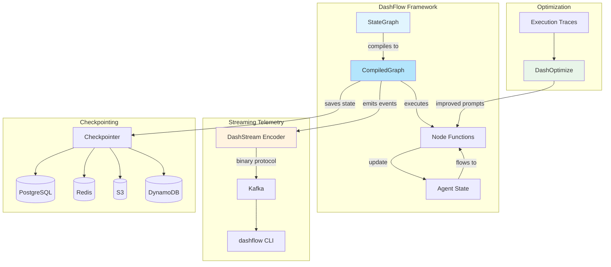
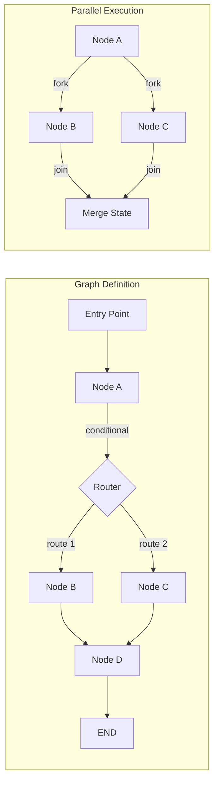
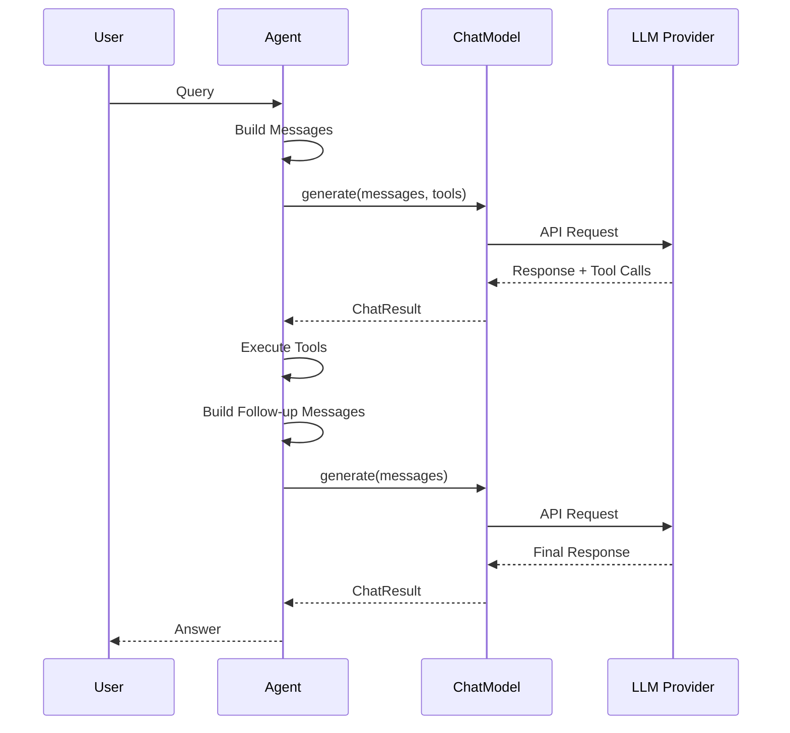
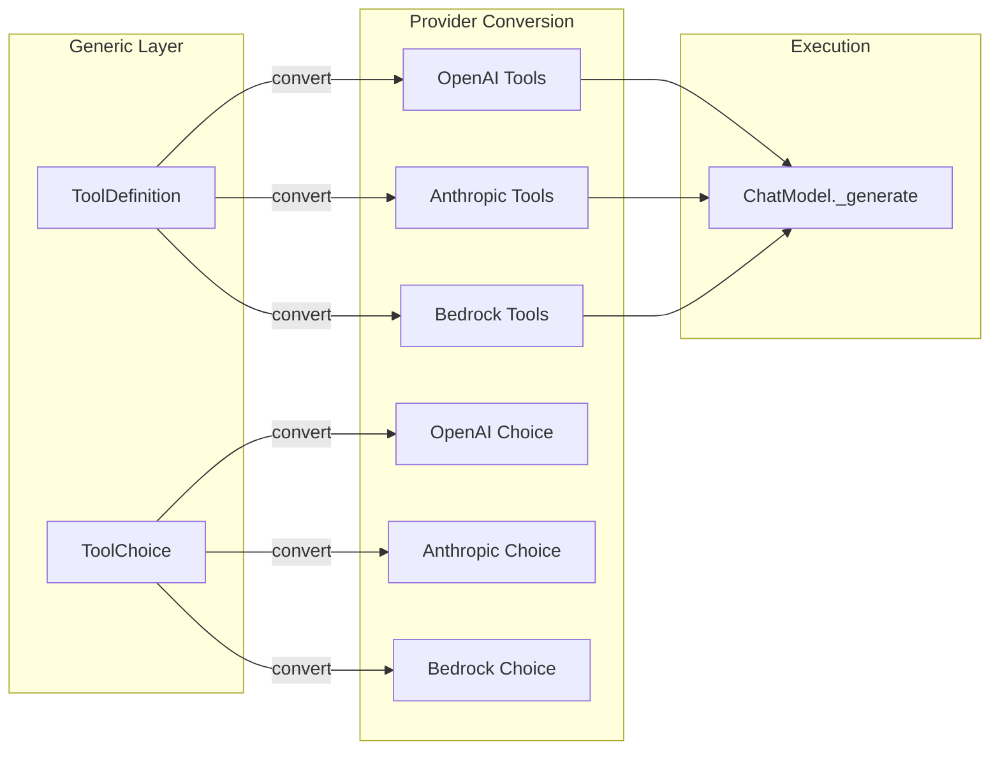
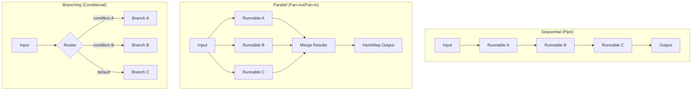
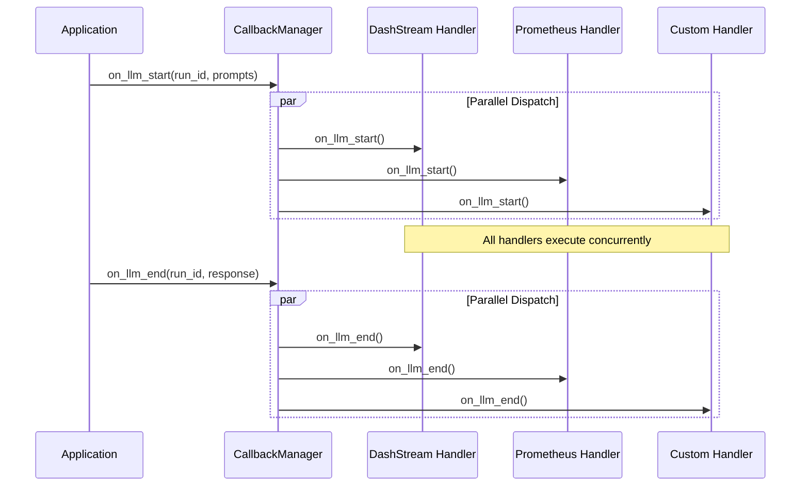
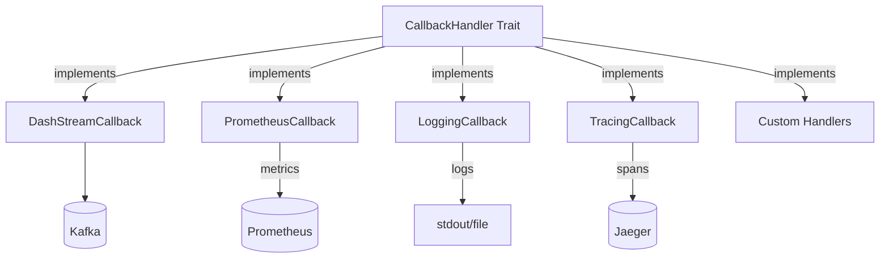

# DashFlow Architecture Design

Core architecture and design patterns for DashFlow implementation.

If you’re contributing to DashFlow internals (executor loop, WAL/trace persistence, scheduling), see `docs/INTERNAL_ARCHITECTURE.md`.

---

## Visual Architecture Overview

### High-Level System Architecture



### Graph Execution Flow



### Message Flow in Chat Models



### Tool Calling Architecture



---

## Table of Contents

1. [Core Traits](#core-traits)
2. [Message System](#message-system)
3. [Agent Architecture](#agent-architecture)
4. [Runnable Composition](#runnable-composition)
5. [Error Handling](#error-handling)
6. [Serialization Strategy](#serialization-strategy)
7. [Callback System](#callback-system)
8. [Async Patterns](#async-patterns)

---

## Core Traits

### Runnable Trait

The foundation of DashFlow Expression Language (LCEL). Every component implements this trait.

```rust
use async_trait::async_trait;
use futures::stream::Stream;

#[async_trait]
pub trait Runnable<Input, Output>: Send + Sync {
    /// Synchronous invoke - transform single input to output
    fn invoke(&self, input: Input, config: Option<RunnableConfig>) -> Result<Output>;

    /// Asynchronous invoke
    async fn ainvoke(&self, input: Input, config: Option<RunnableConfig>) -> Result<Output>;

    /// Batch processing - transform multiple inputs
    async fn batch(&self, inputs: Vec<Input>, config: Option<RunnableConfig>)
        -> Result<Vec<Output>>;

    /// Streaming - stream output chunks
    fn stream(&self, input: Input, config: Option<RunnableConfig>)
        -> impl Stream<Item = Result<Output>>;

    async fn astream(&self, input: Input, config: Option<RunnableConfig>)
        -> impl Stream<Item = Result<Output>>;

    /// Schema information
    fn input_schema(&self) -> Schema;
    fn output_schema(&self) -> Schema;

    /// Composition - chain this runnable with another
    fn pipe<R, O>(self, next: R) -> RunnableSequence<Self, R, Input, Output, O>
    where
        R: Runnable<Output, O>,
        Self: Sized;
}
```

### ChatModel Trait

Extends Runnable for chat-specific operations.

```rust
#[async_trait]
pub trait ChatModel: Send + Sync {
    /// Generate a response from messages with optional tool support
    async fn _generate(
        &self,
        messages: &[BaseMessage],
        stop: Option<&[String]>,
        tools: Option<&[ToolDefinition]>,
        tool_choice: Option<&ToolChoice>,
        run_manager: Option<&CallbackManager>,
    ) -> Result<ChatResult>;

    /// Generate with streaming
    async fn _stream(
        &self,
        messages: &[BaseMessage],
        stop: Option<&[String]>,
        tools: Option<&[ToolDefinition]>,
        tool_choice: Option<&ToolChoice>,
        run_manager: Option<&CallbackManager>,
    ) -> Result<Pin<Box<dyn Stream<Item = Result<ChatResult>> + Send>>>;

    /// Get model configuration
    fn model_name(&self) -> &str;
}
```

#### Tool Calling Design

Tool calling integration uses **direct parameter passing** instead of Python's `bind_tools()` approach:

**Design Decision Rationale:**
- Python uses `RunnableBinding` wrappers because of dynamic typing and runtime composition patterns
- Rust's static typing and explicit lifetimes make direct parameter passing clearer and simpler
- Agents own both the model and tools, so direct passing is more natural
- Achieves functional equivalence with Python without complex wrapper machinery

**Tool Definition Types:**
```rust
/// Generic tool definition that providers convert to their specific formats
pub struct ToolDefinition {
    pub name: String,
    pub description: String,
    pub parameters: serde_json::Value,  // JSON Schema
}

/// Tool choice control
pub enum ToolChoice {
    Auto,      // Let model decide
    None,      // Don't use tools
    Required,  // Must use a tool
    Specific(String),  // Use specific tool by name
}
```

**Provider Conversion Pattern:**
Each provider implements two conversion helpers:
1. `convert_tool_definition()` - `ToolDefinition` → Provider-specific tool format
2. `convert_tool_choice()` - `ToolChoice` → Provider-specific choice enum

Example (OpenAI):
```rust
fn convert_tool_definition(tool: &ToolDefinition) -> ChatCompletionTool {
    ChatCompletionTool {
        r#type: ChatCompletionToolType::Function,
        function: FunctionObject {
            name: tool.name.clone(),
            description: Some(tool.description.clone()),
            parameters: Some(tool.parameters.clone()),
            strict: None,
        },
    }
}
```

### Embeddings Trait

```rust
#[async_trait]
pub trait Embeddings: Send + Sync {
    /// Embed multiple documents
    async fn embed_documents(&self, texts: Vec<String>) -> Result<Vec<Vec<f32>>>;

    /// Embed a single query
    async fn embed_query(&self, text: String) -> Result<Vec<f32>>;

    /// Get embedding dimensions
    fn dimensions(&self) -> usize;
}
```

### VectorStore Trait

```rust
#[async_trait]
pub trait VectorStore: Send + Sync {
    type Filter: Send + Sync;

    /// Add documents to the store
    async fn add_documents(&mut self, documents: Vec<Document>) -> Result<Vec<String>>;

    /// Similarity search
    async fn similarity_search(
        &self,
        query: String,
        k: usize,
        filter: Option<Self::Filter>
    ) -> Result<Vec<Document>>;

    /// Similarity search with scores
    async fn similarity_search_with_score(
        &self,
        query: String,
        k: usize
    ) -> Result<Vec<(Document, f32)>>;

    /// Delete documents by IDs
    async fn delete(&mut self, ids: Vec<String>) -> Result<()>;
}
```

### Tool Trait

```rust
#[async_trait]
pub trait Tool: Send + Sync {
    type Input: serde::de::DeserializeOwned;
    type Output: serde::Serialize;

    /// Tool name
    fn name(&self) -> &str;

    /// Tool description
    fn description(&self) -> &str;

    /// JSON Schema for input
    fn schema(&self) -> Schema;

    /// Execute the tool
    async fn run(&self, input: Self::Input) -> Result<Self::Output>;
}
```

---

## Message System

### Message Enum

```rust
use serde::{Deserialize, Serialize};

#[derive(Debug, Clone, Serialize, Deserialize)]
#[serde(tag = "type", rename_all = "snake_case")]
pub enum Message {
    Human(HumanMessage),
    AI(AIMessage),
    System(SystemMessage),
    Tool(ToolMessage),
    Function(FunctionMessage),
}

impl Message {
    pub fn human(content: impl Into<String>) -> Self {
        Message::Human(HumanMessage::new(content))
    }

    pub fn ai(content: impl Into<String>) -> Self {
        Message::AI(AIMessage::new(content))
    }

    pub fn system(content: impl Into<String>) -> Self {
        Message::System(SystemMessage::new(content))
    }
}
```

### Message Types

```rust
#[derive(Debug, Clone, Serialize, Deserialize)]
pub struct HumanMessage {
    pub id: Option<String>,
    pub content: MessageContent,
    pub name: Option<String>,
    #[serde(default)]
    pub metadata: HashMap<String, serde_json::Value>,
}

#[derive(Debug, Clone, Serialize, Deserialize)]
pub struct AIMessage {
    pub id: Option<String>,
    pub content: MessageContent,
    #[serde(default)]
    pub tool_calls: Vec<ToolCall>,
    pub usage_metadata: Option<UsageMetadata>,
    #[serde(default)]
    pub response_metadata: HashMap<String, serde_json::Value>,
}

#[derive(Debug, Clone, Serialize, Deserialize)]
pub struct SystemMessage {
    pub id: Option<String>,
    pub content: MessageContent,
}

#[derive(Debug, Clone, Serialize, Deserialize)]
pub struct ToolMessage {
    pub id: Option<String>,
    pub tool_call_id: String,
    pub content: String,
    pub name: Option<String>,
}
```

### Content Types

```rust
#[derive(Debug, Clone, Serialize, Deserialize)]
#[serde(untagged)]
pub enum MessageContent {
    Text(String),
    Blocks(Vec<ContentBlock>),
}

#[derive(Debug, Clone, Serialize, Deserialize)]
#[serde(tag = "type", rename_all = "snake_case")]
pub enum ContentBlock {
    Text { text: String },
    Image { image_url: ImageUrl },
    Audio { audio_url: String },
    Video { video_url: String },
    File { file_url: String, mime_type: Option<String> },
    ToolCall { id: String, name: String, args: serde_json::Value },
    Reasoning { content: String },
}

#[derive(Debug, Clone, Serialize, Deserialize)]
pub struct ImageUrl {
    pub url: String,
    #[serde(skip_serializing_if = "Option::is_none")]
    pub detail: Option<String>,
}
```

### Usage Metadata

```rust
#[derive(Debug, Clone, Serialize, Deserialize)]
pub struct UsageMetadata {
    pub input_tokens: u32,
    pub output_tokens: u32,
    pub total_tokens: u32,
    #[serde(skip_serializing_if = "Option::is_none")]
    pub input_token_details: Option<InputTokenDetails>,
    #[serde(skip_serializing_if = "Option::is_none")]
    pub output_token_details: Option<OutputTokenDetails>,
}

#[derive(Debug, Clone, Serialize, Deserialize)]
pub struct InputTokenDetails {
    pub cached_tokens: u32,
    pub text_tokens: u32,
    pub audio_tokens: u32,
}

#[derive(Debug, Clone, Serialize, Deserialize)]
pub struct OutputTokenDetails {
    pub text_tokens: u32,
    pub audio_tokens: u32,
    pub reasoning_tokens: u32,
}
```

---

## Agent Architecture

### Agent Trait

Agents autonomously use tools to solve tasks through iterative reasoning.

```rust
#[async_trait]
pub trait Agent: Send + Sync {
    /// Plan the next action given input and history
    async fn plan(&self, input: &str, intermediate_steps: &[AgentStep]) -> Result<AgentDecision>;

    /// Return key for input in agent state
    fn input_keys(&self) -> Vec<String>;

    /// Return key for output in agent state
    fn output_keys(&self) -> Vec<String>;
}
```

### Agent Decision Types

```rust
/// Result of agent planning
pub enum AgentDecision {
    Action(AgentAction),
    Finish(AgentFinish),
}

/// Action to take
pub struct AgentAction {
    pub tool: String,
    pub tool_input: ToolInput,
    pub log: String,
}

/// Final answer
pub struct AgentFinish {
    pub return_values: HashMap<String, String>,
    pub log: String,
}

/// Record of action + observation
pub struct AgentStep {
    pub action: AgentAction,
    pub observation: String,
}
```

### Agent-LLM Integration

Agents pass tools directly to chat models during generation:

```rust
// Inside agent's plan() method
let result = self.chat_model.generate(
    &messages,
    Some(&self.stop_sequences),   // Stop sequences prevent hallucinated observations
    Some(&self.tool_definitions),  // Tools available to the model
    Some(&ToolChoice::Auto),       // Let model decide when to use tools
    config,
).await?;
```

**Stop Sequences:**
- Each agent type has specific stop sequences (e.g., "Observation:", "\n\n")
- Prevents the model from hallucinating tool outputs
- Passed to chat model on every generation call

**Tool Definitions:**
- Agents maintain `tool_definitions: Vec<ToolDefinition>`
- Generated from tools at construction time via `tools_to_definitions()`
- Passed to chat model on every generation call
- Chat models convert to provider-specific formats

### Agent Types

#### ReActAgent
Reasoning and Acting agent with structured thought process.

**Stop Sequences:** `["Observation:", "Observation:\n"]`
**Prompt Pattern:**
```
Answer the following questions as best you can. You have access to the following tools:

{tool_descriptions}

Use the following format:

Question: the input question
Thought: think about what to do
Action: the action to take (one of [{tool_names}])
Action Input: the input to the action
Observation: the result of the action
... (repeat Thought/Action/Action Input/Observation)
Thought: I now know the final answer
Final Answer: the final answer
```

#### StructuredChatAgent
Multi-input tool support with JSON arguments.

**Stop Sequences:** `["Observation:", "Observation:\n"]`
**Features:**
- Tools accept structured JSON inputs (not just strings)
- Better for complex multi-parameter tools

#### OpenAIFunctionsAgent
Uses OpenAI's native function calling format.

**Stop Sequences:** None (relies on OpenAI's tool use format)
**Features:**
- Leverages provider-native tool calling
- More reliable than prompt-based tool use

#### ToolCallingAgent
Generic tool calling agent for models with native tool support.

**Stop Sequences:** None (relies on model's native tool use)
**Features:**
- Works with any provider that supports tools (OpenAI, Anthropic, etc.)
- Converts tool definitions to provider-specific formats
- Handles tool calls in message history

---

## Runnable Composition

### Composition Patterns Diagram



### RunnableSequence (Pipe Operator)

```rust
pub struct RunnableSequence<First, Second, I, Mid, O>
where
    First: Runnable<I, Mid>,
    Second: Runnable<Mid, O>,
{
    first: First,
    second: Second,
    _phantom: PhantomData<(I, Mid, O)>,
}

#[async_trait]
impl<First, Second, I, Mid, O> Runnable<I, O> for RunnableSequence<First, Second, I, Mid, O>
where
    First: Runnable<I, Mid> + Send + Sync,
    Second: Runnable<Mid, O> + Send + Sync,
    I: Send + 'static,
    Mid: Send + 'static,
    O: Send + 'static,
{
    async fn ainvoke(&self, input: I, config: Option<RunnableConfig>) -> Result<O> {
        let mid = self.first.ainvoke(input, config.clone()).await?;
        self.second.ainvoke(mid, config).await
    }

    // ... other methods
}
```

### RunnableParallel

```rust
pub struct RunnableParallel<I, K, V>
where
    K: Hash + Eq + Clone,
    V: Runnable<I, serde_json::Value>,
{
    runnables: HashMap<K, V>,
    _phantom: PhantomData<I>,
}

#[async_trait]
impl<I, K, V> Runnable<I, HashMap<K, serde_json::Value>> for RunnableParallel<I, K, V>
where
    I: Clone + Send + Sync + 'static,
    K: Hash + Eq + Clone + Send + Sync + 'static,
    V: Runnable<I, serde_json::Value> + Send + Sync,
{
    async fn ainvoke(
        &self,
        input: I,
        config: Option<RunnableConfig>
    ) -> Result<HashMap<K, serde_json::Value>> {
        let mut futures = Vec::new();

        for (key, runnable) in &self.runnables {
            let input_clone = input.clone();
            let config_clone = config.clone();
            let key_clone = key.clone();

            futures.push(async move {
                let result = runnable.ainvoke(input_clone, config_clone).await?;
                Ok((key_clone, result))
            });
        }

        let results = futures::future::try_join_all(futures).await?;
        Ok(results.into_iter().collect())
    }
}
```

### Pipe Operator Implementation

```rust
// Option 1: Method chaining (recommended)
impl<I, O> Runnable<I, O> {
    fn pipe<R, O2>(self, next: R) -> RunnableSequence<Self, R, I, O, O2>
    where
        R: Runnable<O, O2>,
        Self: Sized,
    {
        RunnableSequence::new(self, next)
    }
}

// Option 2: BitOr trait (optional, for |operator)
use std::ops::BitOr;

impl<A, B, I, O1, O2> BitOr<B> for A
where
    A: Runnable<I, O1>,
    B: Runnable<O1, O2>,
{
    type Output = RunnableSequence<A, B, I, O1, O2>;

    fn bitor(self, rhs: B) -> Self::Output {
        RunnableSequence::new(self, rhs)
    }
}
```

---

## Error Handling

### Error Types

```rust
use thiserror::Error;

#[derive(Error, Debug)]
pub enum DashFlowError {
    #[error("LLM error: {0}")]
    LLMError(String),

    #[error("Validation error: {0}")]
    ValidationError(String),

    #[error("Tool execution error: {0}")]
    ToolError(String),

    #[error("Serialization error: {0}")]
    SerializationError(#[from] serde_json::Error),

    #[error("HTTP error: {0}")]
    HttpError(#[from] reqwest::Error),

    #[error("IO error: {0}")]
    IoError(#[from] std::io::Error),

    #[error("Callback error: {0}")]
    CallbackError(String),

    #[error("Output parser error: {0}")]
    OutputParserError(String),

    #[error("Rate limit exceeded: {0}")]
    RateLimitError(String),

    #[error("Timeout error: {0}")]
    TimeoutError(String),
}

pub type Result<T> = std::result::Result<T, DashFlowError>;
```

---

## Serialization Strategy

### Serde + Validator

```rust
use serde::{Deserialize, Serialize};
use validator::Validate;

#[derive(Debug, Clone, Serialize, Deserialize, Validate)]
pub struct RunnableConfig {
    #[validate(length(min = 1))]
    pub tags: Option<Vec<String>>,
    pub metadata: Option<HashMap<String, serde_json::Value>>,
    #[serde(skip)]
    pub callbacks: Option<Vec<Arc<dyn CallbackHandler>>>,
    pub run_name: Option<String>,
    #[validate(range(min = 1))]
    pub max_concurrency: Option<usize>,
    pub recursion_limit: Option<u32>,
    pub configurable: Option<HashMap<String, serde_json::Value>>,
}

impl RunnableConfig {
    pub fn validate(&self) -> Result<()> {
        Validate::validate(self)
            .map_err(|e| DashFlowError::ValidationError(e.to_string()))
    }
}
```

### JSON Schema Generation

```rust
use schemars::{JsonSchema, schema_for};

#[derive(Debug, Serialize, Deserialize, JsonSchema)]
pub struct SearchInput {
    #[serde(description = "The search query")]
    pub query: String,

    #[serde(default = "default_limit")]
    pub limit: u32,
}

fn default_limit() -> u32 { 10 }

// Generate schema
let schema = schema_for!(SearchInput);
let json = serde_json::to_string_pretty(&schema)?;
```

---

## Callback System

### Callback Event Flow



### Callback Handler Types



```rust
use uuid::Uuid;

#[async_trait]
pub trait CallbackHandler: Send + Sync {
    async fn on_llm_start(&self, run_id: Uuid, prompts: Vec<String>) {}
    async fn on_llm_end(&self, run_id: Uuid, response: LLMResult) {}
    async fn on_llm_error(&self, run_id: Uuid, error: &DashFlowError) {}

    async fn on_chain_start(&self, run_id: Uuid, inputs: serde_json::Value) {}
    async fn on_chain_end(&self, run_id: Uuid, outputs: serde_json::Value) {}
    async fn on_chain_error(&self, run_id: Uuid, error: &DashFlowError) {}

    async fn on_tool_start(&self, run_id: Uuid, tool_name: String, input: String) {}
    async fn on_tool_end(&self, run_id: Uuid, output: String) {}
    async fn on_tool_error(&self, run_id: Uuid, error: &DashFlowError) {}
}

pub struct CallbackManager {
    handlers: Vec<Arc<dyn CallbackHandler>>,
}

impl CallbackManager {
    pub fn new(handlers: Vec<Arc<dyn CallbackHandler>>) -> Self {
        Self { handlers }
    }

    pub async fn on_llm_start(&self, run_id: Uuid, prompts: Vec<String>) {
        let futures: Vec<_> = self.handlers
            .iter()
            .map(|h| h.on_llm_start(run_id, prompts.clone()))
            .collect();

        futures::future::join_all(futures).await;
    }

    // ... other methods
}
```

---

## Async Patterns

### Streaming with async-stream

```rust
use async_stream::stream;
use futures::stream::Stream;

pub fn astream(&self, input: Input) -> impl Stream<Item = Result<Output>> + '_ {
    stream! {
        let chunks = self.generate_chunks(input).await?;
        for chunk in chunks {
            yield Ok(chunk);
        }
    }
}
```

### Batch Processing with Tokio

```rust
use tokio::task::JoinSet;

pub async fn batch(&self, inputs: Vec<Input>) -> Result<Vec<Output>> {
    let mut set = JoinSet::new();

    for input in inputs {
        let this = self.clone();
        set.spawn(async move {
            this.ainvoke(input, None).await
        });
    }

    let mut results = Vec::new();
    while let Some(res) = set.join_next().await {
        results.push(res??);
    }

    Ok(results)
}
```

### Retry Logic with backoff

```rust
use backoff::ExponentialBackoff;

pub async fn ainvoke_with_retry(&self, input: Input) -> Result<Output> {
    let backoff = ExponentialBackoff::default();

    backoff::future::retry(backoff, || async {
        self.ainvoke(input.clone(), None)
            .await
            .map_err(|e| {
                if e.is_retryable() {
                    backoff::Error::transient(e)
                } else {
                    backoff::Error::permanent(e)
                }
            })
    }).await
}
```

---

## State Design and Performance

### State Cloning Trade-offs

DashFlow's execution model passes state as an owned value (`execute(state: S) -> Result<S>`), requiring state cloning between nodes. This enables clean, functional-style composition but introduces performance overhead when state contains large heap-allocated collections.

**Key Insight:** State cloning overhead becomes significant (50%+ of execution time) when using `HashMap` or other heap-allocated collections with medium-to-large states.

### Performance Benchmarks

| State Type | Size | Clone Time | 3-Node Execution | Cloning Overhead |
|------------|------|------------|------------------|------------------|
| Vec (small) | < 1 KB | 275 ps | 805 ns | 3× (34% cloning) |
| HashMap (medium) | 1-10 KB | 2.91 μs | 16.4 μs | **5.7× (53% cloning)** |
| HashMap (large) | > 100 KB | 31.6 μs | 170 μs | **5.4× (56% cloning)** |

### Design Patterns for Optimal Performance

#### 1. Use Vec for Sequential Message History

**Good** (34% cloning overhead):
```rust
#[derive(Clone, Serialize, Deserialize)]
struct AgentState {
    messages: Vec<BaseMessage>,  // Sequential access, cache-friendly
    current_task: String,
}
```

**Why Vec is Fast:**
- Contiguous memory layout (cache-friendly)
- Single heap allocation for entire array
- Clone copies pointer + metadata, then memcpy data
- No bucket iteration or rehashing

#### 2. Avoid HashMap for Large State Collections

**Slow** (53% cloning overhead):
```rust
#[derive(Clone, Serialize, Deserialize)]
struct AgentState {
    data: HashMap<String, Vec<String>>,  // Many heap allocations
    metrics: HashMap<String, f64>,
}
```

**Why HashMap is Slow:**
- Multiple heap allocations (one per entry + buckets)
- Clone iterates all entries, cloning keys and values individually
- Rehashing overhead during clone
- Poor cache locality

**Better Alternative:**
```rust
#[derive(Clone, Serialize, Deserialize)]
struct AgentState {
    data: Vec<(String, Vec<String>)>,  // 5× faster clone
    metrics: Vec<(String, f64)>,
}
```

**When HashMap is Acceptable:**
- Small maps (< 10 entries): 2.9μs clone overhead tolerable
- Infrequent lookups: Benefit of O(1) lookup outweighs clone cost
- Short graphs (1-2 nodes): Clone only happens 1-2 times

#### 3. Use Arc for Large Read-Only Data

**Optimal** (<1% cloning overhead):
```rust
#[derive(Clone, Serialize, Deserialize)]
struct AgentState {
    messages: Vec<BaseMessage>,
    #[serde(skip)]  // Don't serialize Arc (reconstruct on load)
    document_index: Arc<Vec<Document>>,  // Shared, no clone cost
}
```

**When to Use Arc:**
- Large read-only data (> 100 KB)
- Reference data that doesn't change during execution
- Embeddings, document corpora, model weights

**Trade-offs:**
- Requires `#[serde(skip)]` and manual reconstruction on deserialization
- Adds indirection (negligible runtime cost)
- Cannot modify data without `Arc::make_mut()` (expensive)

#### 4. Keep State Minimal

**Good:**
```rust
#[derive(Clone, Serialize, Deserialize)]
struct AgentState {
    messages: Vec<BaseMessage>,  // Only essential conversation history
    next_action: String,         // Current step
}
```

**Avoid:**
```rust
#[derive(Clone, Serialize, Deserialize)]
struct AgentState {
    messages: Vec<BaseMessage>,
    all_tool_results: HashMap<String, String>,  // Can be derived
    thinking_log: Vec<String>,                  // Debug-only data
    intermediate_states: Vec<AgentState>,       // Recursive overhead
}
```

**Principles:**
- Only store data needed for decision-making
- Derive computed fields in node functions
- Use `#[serde(skip)]` for debug/logging fields
- Avoid recursive nesting of state

### Optimization Summary

| Pattern | Clone Overhead | Use Case |
|---------|---------------|----------|
| `Vec<T>` | 34% | Sequential collections (messages, steps) |
| `Arc<T>` | <1% | Large read-only data (documents, embeddings) |
| `HashMap<K, V>` | 53-56% | Small maps (<10 entries) or infrequent use |
| Minimal state | Varies | Always: only store essential data |

### API v2.0 Considerations (Future Work)

Current API requires cloning due to owned state parameter. Breaking changes for 50% speedup:

**Option 1:** Mutable reference (breaks node signatures)
```rust
async fn execute(&self, state: &mut S) -> Result<()>;
```

**Option 2:** Arc-based sharing (breaks state ownership model)
```rust
async fn execute(&self, state: Arc<S>) -> Arc<S>;
```

**Option 3:** Thread-local state pool (requires `S: 'static`)
```rust
async fn execute(&self, state: S) -> Result<S>;  // Same signature, pooled clone
```

**Decision:** Defer to dedicated v2.0 redesign session after v1.2 features complete.

---

## Design Principles

1. **Composition over Inheritance** - Use traits and composition
2. **Type Safety** - Leverage Rust's type system
3. **Zero-Cost Abstractions** - No runtime overhead
4. **Explicit Error Handling** - Use Result types
5. **Async by Default** - First-class async support
6. **Thread Safety** - All types are Send + Sync
7. **Immutability** - Prefer immutable data structures
8. **Performance-Aware State Design** - Use Vec over HashMap, Arc for large read-only data

---

**Last Updated:** 2026-01-03 (Worker #2361 - Document internal architecture guide)

© 2026 Dropbox (created by Andrew Yates <ayates@dropbox.com>)
